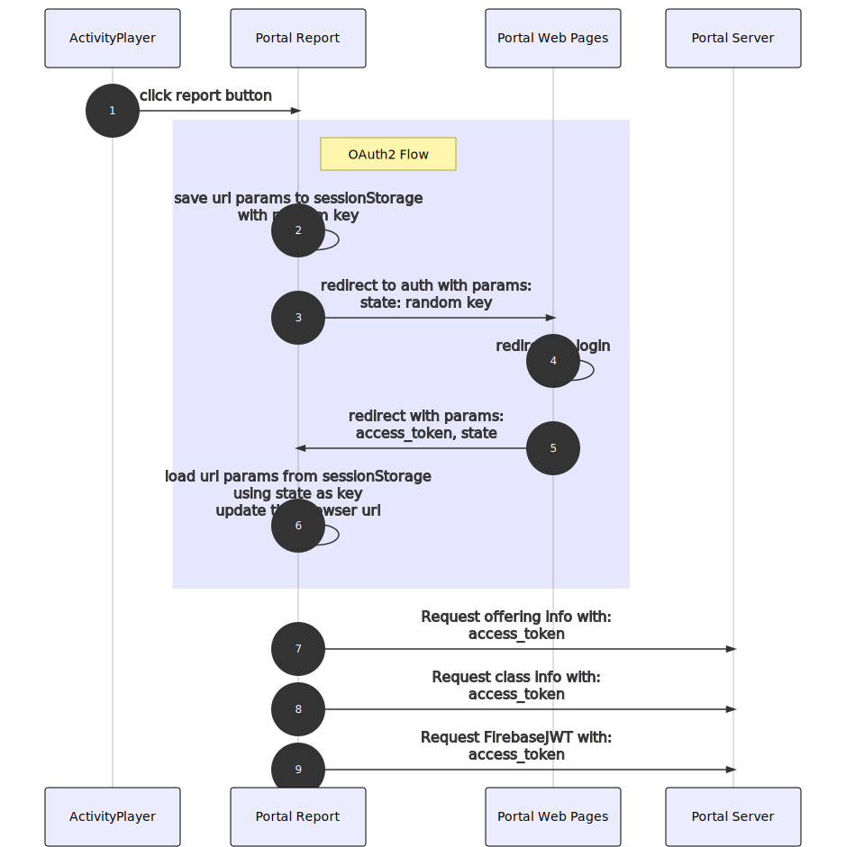

The portal report can run in multiple different modes depending on which URL params are passed to it.

## Modes

### Views
- Classic Report
- Dashboard
- Portal Dashboard

### Data
- Fake Data
- Legacy Portal Data (not sure if this is still supported)
- Report Service Data

### Authentication
- Anonymous Fake Data
- Launched from Portal with short-lived token
- Launched from third party site with anonymous run key
- Launched from third party site and authenticate user

## Details

### Launched from third party site and authenticate user



In this diagram the Activity Player could be substituted for another third party site. For example we plan to use this kind of launch from spreadsheets generated for researchers.

#### Initial Launch Params (#1 in the diagram)

- **class** URL to portal class api to get info about the class
- **firebase-app** firebase app name in the portal. It defaults to "report-service". You might set this to work with the development firestore database with "report-service-dev"
- **offering** URL used to request info from the portal about this assignment in the portal
- **reportType** always set to `offering`
- **studentId** user id of the student this report is being opened for
- **sourceKey** main source key used in the paths for the various documents used by the portal report. See URL Parameters section below for more info.
- **answersSourceKey** the source key for the answers. See URL Parameters section below for more info.
- **auth-domain** URL for the authentication domain, usually the portal so it would usually be `https://learn.concord.org`

#### Request to portal OAuth2 (#3 in the diagram)

- URL: `${auth-domain}/auth/oauth_authorize` This uses the `auth-domain` from the launch params to know where to send the OAuth2 request to.
- Params:
  - **clientId** currently hardcoded to `"portal-report"`. This needs to be the `App Id` a client in the portal that has a redirect url which exactly matches the `redirectUri` below. And the client "client type" needs to be configured as 'public', so it allows browser requests for access_tokens.
  - **redirectUri** current portal-report url without any parameters (this way it will include any version or branch path)
  - **state** this is a random string that is used as a key to restore all of the params from the launch after OAuth2 is done. The state has a size limit so the params themselves cannot be sent directly as the state.
- Code Location: `api.ts#authorizeInPortal`

#### Notes on URLs generated by portal for portal-report

When the portal redirects back to the portal report it uses a URL like:
https://portal-report.concord.org/branch/master/index.html#access_token=231cb8cfd58438f234c1c0b57e2d9053&token_type=bearer&expires_in=604800&state=2bf6oio5yg1

The `access_token` in this url is intended for the portal-report to get a JWT that it then will use to make further requests. However currently the `access_token` is used for the offering and classes requests too:
https://learn.concord.org/api/v1/offerings/135999
https://learn.concord.org/api/v1/classes/60888

Here is an example request for the JWT:
https://learn.concord.org/api/v1/jwt/firebase?firebase_app=report-service-pro&class_hash=7883841115415ce2255ec7d0eef80f8c6e096191d63b5be1&resource_link_id=135999&target_user_id=1063089

Note that the `target_user_id` parameter is passed. This is necessary so the returned JWT will include the `target_user_id` property if the researcher requesting the JWT has access to this target user's data.

##### To do: Researchers, project researchers and project admins should be able to load interactive links from the details report

The details report generated by report-service includes links to view the interactives with students' saved state. These links can be opened by portal wide admins or teachers in the class. The problem is that these links cannot currently be opened by portal wide admins, project researchers, or project admins.

This problem stems from the portal-report requesting information about the class and the offering.

The class request succeeds due to a bug in the Portal code which basically allows any authenticated user to access any class's information. Due to this line:
```
teacher_in_class = !student_in_class || (user.portal_teacher && user.portal_teacher.has_clazz?(clazz))
```

The offering request fails because it currently only allows teachers, students, and admins.

These requests could be skipped if more info was passed through the link parameters. You can see the info necessary here:
https://github.com/concord-consortium/portal-report/blob/95726ebba5a4a19b7605f9f3b38ab1c44138f32e/js/api.ts#L186

It needs the `class_hash` and the offering id. It could get the offering id from the `offering` param which is currently a URL. But the `class_hash` is only available after making the request.

So to fix it this way:

- the report-service/query-creator should know the `class_hash` and `offering_id` and put them link.
- the portal-report needs to handle links with these ids and skip the requests
- the portal has to be updated to provide the `class_hash` to the query-creator

The current list of properties provided to the query-creator is here: https://github.com/concord-consortium/rigse/blob/f99b3a032353e976b056932edc5c0f045a230c04/rails/app/controllers/api/v1/report_learners_es_controller.rb#L426-L443

This last bullet might require updating the Elastic Search model to include the `class_hash`. An alternative to this would be to update the JWT endpoint in the portal so it can take a `class_id` instead of a `class_hash`. This way the Elastic Search model doesn't have to be updated and neither does the method above providing the learner info.

#### Source Keys in Firestore

This is a brief description of source keys used by the portal report. A more detailed description is in [source-key.md](source-key.md)

##### Resource Structure Source Key

For Activity Player and LARA runtime activities the resource structure will generally be found under `authoring.concord.org`.

For a logged in user the default sourceKey is taken from the portal's offering data activity_url. It is the domain of this URL. For an Activity Player activity this domain will typically be `activity-player.concord.org`. That isn't the right value, so for activity-player activities, the `sourceKey` parameter should be used when launching the report.

When the activity player launches the portal-report itself, it will set the sourceKey parameter.

When the portal launches the portal-report, the parameters will be determined by the external report configured in the portal. The default external report for a resource in the portal is found by the source type of the resource. Regular activity player resources will have a source type of `ActivityPlayer`. Migrated activity player resources will have a source type of `ActivityPlayerMigrated`. The external reports for these source types should set the `sourceKey` and `answersSourceKey` params so the portal report can find the structure and answers.

It is tempting to extract the right source key when the offering.activity_url is an activity player url. Then the sourceKey param would not be needed for activity player report launches. We do this kind of extraction in `_getResourceUrl`. However this level of auto-magic will be hard to track down. It is likely that some activity player activities in the portal will use custom urls for their activities instead of ones authored in LARA. So these setups would need to override the automatic sourceKey so their resource structure would be found. In these cases it is also likely the activity player activity launch would use a report-source to configure the source key where the activity player stores its answers. So in conclusion it is better to avoid URL parsing and be more explicit when possible.

##### Answers Source Key

LARA Runtime activities will generally store their answers with a source key of `authoring.concord.org`. This matches the source key of the resource structure so when viewing a report of the LARA Runtime the `answersSourceKey` won't need to be used.

For activity player activities they will generally store their answers with a source of `activity-player.concord.org`. However, if a resource is migrated from the LARA Runtime to the activity player, the external_activity.url which launches the activity-player will have a `report-source=authoring.concord.org` url parameter. That way the activity player will load in answers that were saved by the LARA runtime and save them back to the same place. In this case when the portal-report is launched the `answersSourceKey` needs to be set so the portal-report also loads the answers from this same source.

When the activity player launches the portal-report itself, it will set the answersSourceKey parameter appropriately.

When the portal launches the portal-report, the parameters will be determined by the external report configured in the portal. The default external report for a resource in the portal is found by the source type of the resource. Regular activity player resources will have a source type of `ActivityPlayer`. Migrated activity player resources will have a source type of `ActivityPlayerMigrated`. The external reports for these source types should set the `sourceKey` and `answersSourceKey` params so the portal report can find the structure and answers.

### Using data

Data is fetched using `api.js`.

If the query parameters of the url do not include values for `offering` and `class`, we will load in fake data from the `js/data` folder. This data gets loaded in much the same way as real data, so can be used for testing.

If we do have `offering` and `class` parameters, then `api.js` will first attempt to get the data for the offering and class from the portal. To do this it also needs a `token` parameter, which is used to authenticate with the portal and expires after one hour. Besides the class and offering data, we will also fetch a firestore JWT from the portal, given the classHash (from the fetched class data), the resourceLinkId (from the offering info), and the auth token. Using this JWT, we can authenticate with Firestore. Once we have successfully authenticated, `receivePortalData` is called in `index.ts`, which starts watching the sequence structure and answer data.

To test the portal using real data, the easiest way is simply to open a report as a teacher from the portal, and then replace the url host and path with `localhost:8080`. Alternatively, if it is OK to mess with the assignment, you can add an additional report to the resource which launches your localhost report. An example of this is the "Developers Tracked Questions (Local)" external report.

### URL Parameters

* `token={string}`: access token provided by the portal when it launches the report. It is used as a Bearer
                    token when making requests to the portal
* `class={url}`:    URL to get info about the class from the portal
* `offering={url}`: URL to get info about the offering from the portal
* `firebase-app={name}`: identifier for a portal Firebase App. This name is sent to the portal to get a FirebaseJWT. It defaults to "report-service".
* `portal-dashboard`: boolean parameter which tells the report to render in a new dashboard style
* `dashboard`:      boolean parameter which tells the report to render in old dashboard style
* `activityIndex={index}`: when the activity is a sequence, only show this activity's questions
* `studentId={id}`: This shows the report for a single student, and removes some UI affordances. The filtering of the student data happens client-side.
* `iframeQuestionId={id}`: This, combined with a valid `studentId`, will show a stand-alone, full-size iframe containing the model referenced by `iframeQuestionId`, and the answer saved by `studentId` (either as state or as a url).
* `sourceKey`: main source key used in the paths for the various documents used by the portal report. The paths are documented in [report-service.md](report-service.md). See the Source Keys section for more details. The parameter is ignored when launching anonymously. See `activity` param. Default value is the hostname of the activity URL from the portal offering data.
* `answersSourceKey`: the source key for the answers. See the Source Keys section for more details. Default value is the value of the `sourceKey` param.
* `logging`: send events to the log manager with `logging=true`

Parameters for showing data stored anonymously in the report service

* `runKey={string}`: identifier for anonymous answers stored in the report service. The activity player generates a runkey when launched anonymously. The activity player then sends this runKey to the portal report when the user clicks the report button in the activity player.
* `activity={uri}`: portal-report uses this uri to find the activity structure in the report service firestore database this uri is also parsed to make the source key for the activity structure. It is important to note that the `sourceKey` param is ignored in this case. If the activity is not specified, fake activity structure will be used.

Parameters for 3rd party launching

* `auth-domain={url}`: root URL for the portal which can authenticate the current user. This parameter can be
                    used instead of the `token` param. The portal report will do an OAuth2 request to the auth-domain
                    in order to get an access-token.

Parameters to help with testing

* `enableFirestorePersistence=true`: Uses a local firestore DB for data persistance across sessions and tabs. Clear the
                    DB by going to `dev tools > Application > IndexedDB > firebaseLocalStorageDb > Delete database`
* `clearFirestorePersistence=true`: Clears local firestore DB. If this and `enableFirestorePersistence=true` are set
                    then the DB will be cleared first before the local persistence is enabled.
* `resourceType`: By default the report loads a fake sequence, with the `resourceType=activity`, it will load a fake activity
* `debugLogging`: Set this to true `debugLogging=true` to record log events to the console
